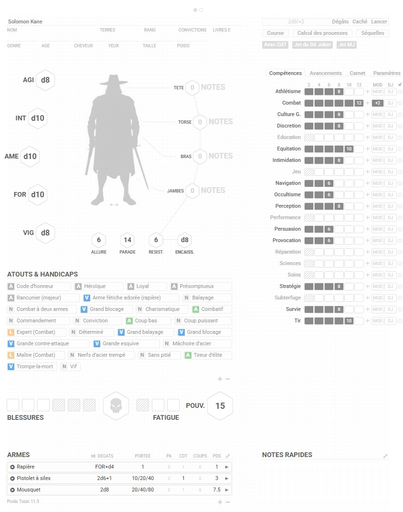

# The Savage World of Solomon Kane 2025

Cette feuille de jeu de rôle à pour base la fantastique feuille de **Tetrakern** pour **[Savage Worlds - Graph Paper](https://github.com/Roll20/roll20-character-sheets/tree/master/Savage%20Worlds%20-%20Graph%20Paper)** de 2020. Elle a été ajusté pour le jeu de role **[The Savage World of Solomon Kane](https://monolithedition.com/produit/the-savage-world-of-solomon-kane-jeu-de-role-livre-de-base-fr/?utm_source=roll20)** paru en 2025.

## Changements

### Améliorations importantes
* **Legacy != Moderne** : Passage de la feuille en mode moderne (remove legacy = false) pour utiliser les nouvelles fonctionnalités.
* **Mode sombre** : Ajout d'un thème sombre pour les yeux sensibles.
* **Parseur de jets de dés français** : Adaptation du parseur pour reconnaître les notations françaises. Exemple : STR+2 devient FOR+2.
* **Ajustement des compétences** : Ensemble des compétences dédiées à Solomon Kane.
* **Choix des compétences pour les armes et pouvoirs** : Les armes n'utilisent pas systématiquement la compétence *Tir*. Un nouveau bouton permet de choisir entre *Tir*, *Combat* et *Athlétisme*. Mêmes options pour les pouvoirs : *Magie*, *Foi* et *Alchimie*.
* **Statuts et états** : Ajout d'infobulles et utilisation des [icônes Material](https://fonts.google.com/icons). Suivi simplifié des états *Vulnérable*, *Distrait*, etc.
* **Mode développeur**: Ajout des fichiers pour construire automatiquement la feuille à partir des fichiers .pug et .scss.

### Ajustements mineurs
* **Nouvelles silhouettes** : Deux nouvelles silhouettes dans l'univers de Solomon Kane (générées par Gemini).
* **Traduction française complète** : Traduction entièrement en français pour usage personnel. Fichiers de traduction disponibles.
* **Paramètres** : Nettoyage des paramètres pour simplifier la feuille.
* **Marqueurs** : Ajout d'un marqueur sur la silhouette pour l'entrejambe.

### Prévisualisation



## Fonctionnalités
* **Blocs** : Alliés, Pouvoirs, Véhicules, etc.
* **Feuille alternative** : Feuille alternative simplifiée pour les figurants et jokers non joueurs.
* **Personnalisable** : Nombreuses options de personnalisation.
* **Dés joker** : Gestion automatique des dés joker et des explosions.
* **Blessures / Fatigue** : Gestion simplifiée des blessures et de la fatigue.
* **Silhouettes** : Ambiance renforcée avec des marqueurs pour suivre vos blessures au fil de vos aventures.

## Mode développeur
La feuille de personnage est compilée à partir de templates [Pug](https://pugjs.org/api/getting-started.html) et de fichiers [SCSS/SASS](https://sass-lang.com/guide) (LibSass). Les deux sont nécessaires pour contribuer ; ne modifiez pas directement les fichiers HTML et CSS compilés, car vos changements seront écrasés.

Pour compiler en continue vos fichiers, lancer la commande suivante :
```shell
npm run dev
```

Dans Roll20, allez dans le **Bac à Sable de feuille** et cibler ce dossier.

## Legal
Cette feuille est un clone de [Savage Worlds - Graph Paper](https://github.com/Roll20/roll20-character-sheets/tree/master/Savage%20Worlds%20-%20Graph%20Paper) et n'utilise aucune image sous licence.